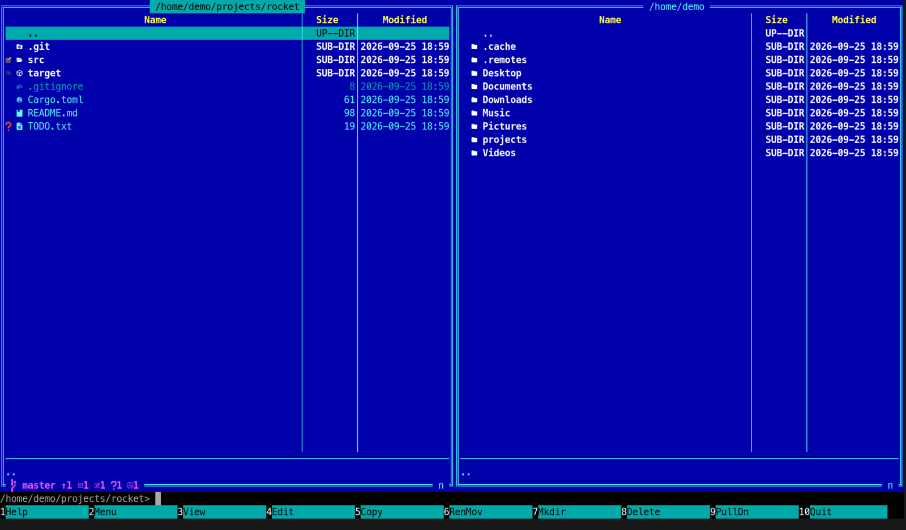
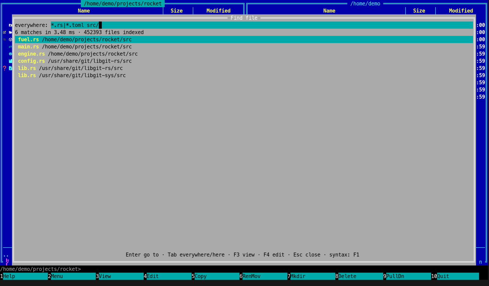
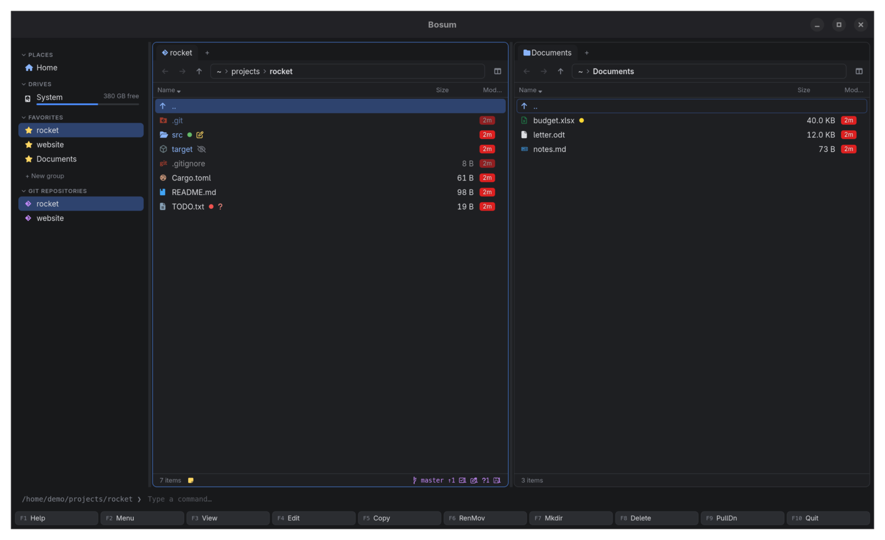
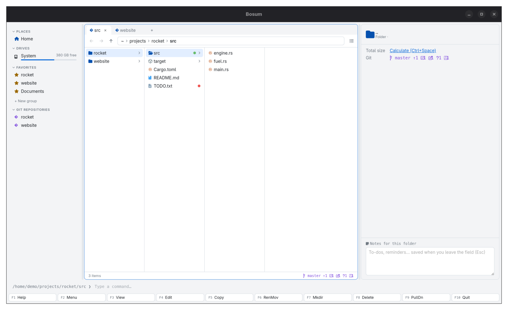

# Bosum

*The ship's officer who actually gets the work done.*

Bosum is a two-panel file manager in the Norton Commander tradition, built for developers. It
comes as a terminal app (Rust + Ratatui) and a desktop app (Tauri + Svelte 5). Both run on one
shared Rust core and read the same config file.

- **Norton Commander at heart.** Blue panels, F-key bar, command line, and NC's keys by default.
- **Git in every panel.** oh-my-posh style branch, ahead/behind, staged/modified/untracked
  counts and stashes, plus a glyph per file (Nerd Font, or ASCII).
- **Search like Everything.** Every file name on the machine sits in RAM and queries run in
  parallel: about 1.4M files index in ~0.2 s and answer in under 10 ms.
- **Configurable.** Key bindings, color schemes, glyphs, user menu and fonts all live in one
  TOML file.



| | |
|---|---|
|  |  |
| Find file: every file on the machine, in milliseconds | Desktop app: sidebar, tabs, color tags, git |
|  | |
| Desktop app: Miller columns and preview, light theme | |

## Install

**Download:** pick your platform under [Releases](https://github.com/mwo-dk/bosum/releases/latest).
The builds are not code-signed; the release notes say how to get past the first-run warning
on Windows and macOS.

**Build from source:**

```sh
git clone https://github.com/mwo-dk/bosum.git
cd bosum
./install/install.sh                                          # Linux, macOS
powershell -ExecutionPolicy Bypass -File install\install.ps1  # Windows
```

The script offers to install Rust and Node.js when they are missing, and asks first. See
[install/INSTALL.md](install/INSTALL.md). For development: `cargo run -p bosum-tui`, or
`cd gui && npm ci && npx tauri dev`.

Git glyphs need a [Nerd Font](https://www.nerdfonts.com/). In the terminal, use one as your
terminal font; the GUI picks up any installed Nerd Font listed in `gui.icon_font`. Without
one, set `glyphs = "ascii"`.

## Keys (defaults)

| Key | Action | Key | Action |
|---|---|---|---|
| F1 | Help | Tab | Other panel |
| F2 | User menu | Insert / Shift+Down | Mark |
| F3 | View | + / - / * | Select / unselect group, invert |
| F4 | Edit | Alt+F7 / Ctrl+F | Find file |
| F5 | Copy | Ctrl+R | Reread |
| F6 | Rename/move | Ctrl+U | Swap panels |
| F7 | Mkdir | Ctrl+O | Show command output |
| F8 / Delete | Delete | Alt+F1 / Alt+F2 | Left/right panel: go to |
| F9 | Command palette | Ctrl+F3..F6 | Sort by name/ext/time/size (again = reverse) |
| F10 | Quit | Alt+letter | Quick search |

Typing goes to the command line. Enter runs it in the panel's directory, and `cd` works. Both
apps support the mouse: click, double-click, right-click to mark, and the wheel. The GUI also
does Shift-click ranges, drag-and-drop between panels, and clickable column headers and paths.

## Using Bosum

Start either app with up to two folders: `bosum ~/src ~/Downloads` or `bosum-gui .`. Without
arguments both panels open in the current folder (the desktop app restores your last session).

**The NC way.** One panel is active. Move with the arrows, Enter opens a folder or file, and
Backspace goes up. Mark files with Insert (or `+` with a pattern like `*.rs`), then F5 copies
or F6 moves them to the *other* panel's folder. With nothing marked, the file under the cursor
is used. F3 views, F4 opens your `$EDITOR`, F8 deletes (after asking). F9 opens a searchable
list of every command, so you never need to remember a key.

**Reading the git line.** Inside a repository the panel's bottom line shows the branch,
commits ahead/behind the upstream, and counts of staged, modified and untracked files and
stashes. Each file and folder gets the same glyph, so a changed file deep
in `src/` marks `src` too. Ignored files get a crossed-out eye.

**Find file** (Alt+F7 or Ctrl+F). Start typing; results update per key. Enter jumps to the
file with the cursor on it, F3 and F4 view and edit it in place, and Tab limits the search to
the current folder. The first start builds the index in the background; after that it is
loaded from disk and kept current while Bosum runs.

**Desktop app extras** (all rebindable, like everything else):

| Key | Action | Key | Action |
|---|---|---|---|
| Ctrl+T / Ctrl+W | New / close tab | Space | Preview pane (text, code, images, Markdown) |
| Ctrl+Tab | Next tab | Alt+V | Details or Miller columns |
| Alt+Left / Alt+Right | Back / forward | Ctrl+B | Sidebar |
| Ctrl+L | Type a path | Ctrl+Space | Folder sizes |
| Ctrl+M | Batch rename with regex, previewed | Alt+T | Color tag |
| Alt+N | Notes for this folder | Alt+. | Hidden files |

The sidebar holds places, drives with free space, favorite groups (right-click a group, then
"Add current folder") and the git repositories you visited recently. Pick a theme from the F9 command list (type "theme").

## Find file

Everything's syntax:

| Query | Matches |
|---|---|
| `foo bar` | names containing both |
| `foo\|bar` | either |
| `!foo` | not foo |
| `*.rs`, `a?c` | wildcards, whole name |
| `ext:rs;toml` | by extension |
| `file:` / `folder:` | only files / only folders |
| `src/ lib` | a term with `/` matches the full path |
| `case:` | case-sensitive |
| `"a b"` | phrase with a space |

Tab switches between searching everywhere and the current directory only.

## Configuration

`bosum --config-path` shows where the file lives (`~/.config/bosum/config.toml` on Linux).
`bosum --dump-config` prints every option with its default. Set only what you want to change:

```toml
theme = "midnight"          # or "nc", or your own [themes.<name>]
glyphs = "nerd"             # or "ascii"
editor = "hx"               # else $VISUAL / $EDITOR

[keys]
quit = ["F10", "Ctrl+Q"]    # listing an action replaces its default keys
search = ["Ctrl+P"]

[themes.mine.panel]         # unset slots fall back to the NC scheme
fg = "#e0e0e0"
bg = "#101820"

[[user_menu]]               # F2; %f file, %d dir, %s selection (shell-quoted)
key = "t"
label = "cargo test"
command = "cargo test"
wait = true

[search]
exclude = ["/proc", "/sys", "node_modules"]   # a path skips a tree; a bare name skips every such directory
watch = true

[gui]
font_size = 15
```

## How search stays fast

The index (`crates/bosum-core/src/index.rs`) keeps each name once in a `\0`-separated byte
buffer, with a 12-byte node per entry (parent, offset, length, flags). A query runs a single
SIMD `memmem` scan over that buffer, split across all cores. Full paths are built only for
hits. The index is saved to the cache directory, so it loads in ~90 ms on the next start. It is
then rebuilt in the background and kept current by file system events (inotify, FSEvents,
ReadDirectoryChangesW).

Run `cargo run --release -p bosum-core --example bench -- /` to measure it on your machine.

Known limits and upgrade paths:

- **Linux:** inotify needs one watch per directory. Past `fs.inotify.max_user_watches`, the
  hourly rebuild catches changes. fanotify would remove that limit, but it needs root.
- **Windows:** the first index comes from a directory walk. Reading the MFT and USN journal
  directly, as Everything does, would make cold starts faster.

## Layout

```
crates/bosum-core   config, fs ops, git status, search index (shared)
crates/bosum-tui    terminal UI (binary: bosum)
gui/                Svelte 5 frontend
gui/src-tauri       Tauri backend (binary: bosum-gui)
```

## License

MIT

Norton Commander is a trademark of Gen Digital Inc. Bosum is an independent project, not
affiliated with or endorsed by Gen Digital.
